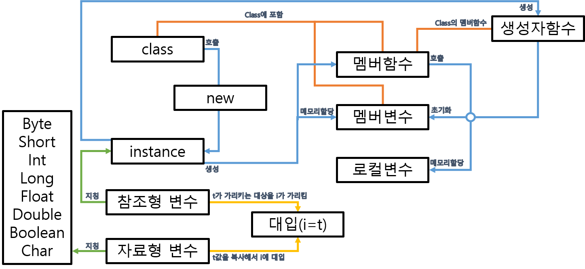

[TOC]

# Day 1

---

## 자바의 8가지 자료형

| byte | short |  int  | long  | float | double |
| :--: | :---: | :---: | :---: | :---: | :----: |
| 8bit | 16bit | 32bit | 64bit | 32bit | 64bit  |

> 자료형의 크기 : **byte < short < int < long < float < double**

이중 `byte, short, int, long`은 정수의 값을 가져다 저장할 수 있는 자료형

작은 타입에서 큰타입은 자동변환이 가능

큰 타입에서 작은탑입은 강제변환이 없으면 에러남

기본적으로 같은 타입형 변수만이 연산가능하다.


## 변수는 값을 저장하는 기억공간

​	자료형 : 변수선언을 할 수 있다.

​	값을 저장할 때는 대입

```java
int i;	//변수선언   int == 자료형   i == 이름
i = 100 ;	//대입
```


## 문제

### 	연 6.6퍼 이자율에 초기금 100만원을 100년간  묵힐때

```java
public class TestCode1 {
    public static void main(String[] args) {
        double money = 1000000;
        double interestRate = 0.066;
        for (int i=0; i<100; i++){
            money += money * interestRate;
        }
        System.out.println((int)money);
    }
}
```


### 	연6.6% 이자율의 복리 (매 100만원 적금)

```java
public class TestCode2 {
    public static void main(String[] args) {
        int addMoney = 1000000;
        double money = 0;
        double interestRate = 0.066;
        for (int i=0; i<100; i++){
            money += addMoney;
            money += money * interestRate;
        }
        System.out.println(money);
        long endTime = System.currentTimeMillis();
    }
}
```

# Day 2

---

​	**코드 잘 짜는 방법**

+ 잘 쪼개서 짠다.

+ 자신의 보폭을 잘 파악해야한다.

+ 반복문이 정리가되려면 일단 늘어놓고 정리한다.


##  Java와 C의 차이점

```java
public class Test001 {
    public static void main(String[] args) {
        int i;
        i = 100;
        System.out.println(i);
    }
}
```

​	**java**는 `int i = 100;` 이 허용됨.

```c
#include <stdio.h>
i1nt main(){
    int i;
    i = 100;
    printf("%d\n", i);
    return 0;
}
```

​	**C**의 경우에는 변수의 선언은 위에 몰아서 하는게 원칙임.

​	`int i; i=100;` 처럼 선언과 대입은 철저히 구분.

## C언어의 개념

### 기본 포인터

```c
#include <stdio.h>
int main(){
    int* t; //포인터도 기억공간 할당 int형 기억공간을 가르키기 위해 쓰임
    int i;
    // 아래 코드에서 *t와 i는 동일하다. 이유는?
    i = 100;
    t = &i;  // t포인터가 i주소의 기억공간을 가리킴
    printf("%d\n, *t"); // t변수가 가르키는 공간
    return 0;
}
```

```
 결과값 : 100
```

​	**C**언어의 경우에는 자료형의 포인터형 변수가 존재한다.

```c
#include <stdio.h>
int main(){
    int* t;
    int* l;
    int i;
    i = 100;
    t = &i;
    l = t; 
    printf("%d\m, *l"); // l값은 100이 나올까?  -> 100이나옴
    return 0;
}
```

```
결과값 : 100
```

​	자료형 변수의 대입과 포인터의 대입은 다르다. 

​	포인터의 대입은 오른쪽이 가리키는 대상을 왼쪽이 가리키게 된다.

​	**포인터의 역할 : 변수타입의 기억공간을 가리키기 위하여**

​	**자료형 변수의 역할 : 값을 저장하기 위하여**

```c
#include <stdio.h>
int main(){
    int i;
    void* t;
    i= 100;
    t = &i;
    return 0;
}
```

```c
#include <stdio.h>
int main(){
    void* t;
    float l
    t = 3.14;
    t = &i;
    return 0;
}
```

> 위의 두 코드 모두 컴파일에러가 나지않음

​	void* 변수는 어떤 기억공간이든 다 가리킨다.

```c
#include <stdio.h>
int main(){
    void* t;
    float l
    t = 3.14;
    t = &i;
    printf("%d\n", *t);
    return 0;
}
```

> 여기서는 컴파일 에러가남

​	void*는 어떤 기억공간이든 다 가리킬 수 있지만 실체에 접근할수는 없다.

```c
#include <stdio.h>
int main(){
    void* t;
    int i;
    i = 100
    t = &i //void*는 기억공간의 꼭지점을 가리킨다고 보자.
    int* h;
    h = (int*)t;
    printf("%d\n", *h);
    return 0;
}
```

```
결과값 : 100
```

​	void*는 꼭짓점만 가르킬 수있음.

​	t가 가리키는 지점을 기준으로 int형 기억공간 만큼을 확장한 기억공간 을 h가 가리킨다.

### 지역변수

```c
#include <stdio.h>
int add(int i, int j){ return 100;}

int main(){
    int r; //지역변수
    r = add(10, 20);
    printf("%\n", r);
    return 0;
}
```

```
결과값 : 100
```

**지역변수** r은 ==함수가 호출되는 시점== 에서 메모리 할당됨

[유일한 리턴타입] [이름]] ( 0.. * 변수선언 - 매개변수 ) { ... }

i , j -> 매개변수 (함수가 호출될 때 메모리 할당됨)

특정 입력값에 대하여 결과값은 하나만 존재

여러 입력값이 존재할 수 있다.

### 전역변수

```c
#include <stdio.h>
int t; //전역변수
int main(){
    int r;
    r = add(10, 20);
    printf("%\n", r);
    return 0;
}
```

**전역 변수** t는 ==컴파일되는 시점==에서 메모리 확보

main도 함수다. 함수안에 변수 선언 가능

함수가 호출되는 시점에메모리 할당. 호출 끝나면 소거

= 오른편이 먼저 동작. 선언된 함수를 호출한다.

함수에는 매개변수가 선언된다.


t 로컬변수가 호출시에 생성되고 i + j 값을 대입당한다. ( 30 )

함수의 종료에는 return ( 변수 / 값 ) 인데 ( 변수 / 값 )은 함수의 리턴타입을 만족해야한다. ( int )

r = add( 10, 20 ); 의 결과로 return t 가 동작하면 r = t 의 현상이 벌어짐

### 함수 포인터

```c
#include <stdio.h>
int add(int i, int j){ return i+j;}

int main(){
	int r;
    // 아래와 같이선언된 변수 fp는 함수를 가리 킬 수 있다.
    // 리턴타입이 int, 매개변수가 int, int형태로 선언된 함수를.
    int (*fp)( int, int);
    fp = add;
    //fp 라는 함수가 아닌 fp 변수가 가리키는 함수를 호출한다.
    r = fp(10, 20);
    printf("%d\n", r);
    return 0;
    
}
```

> JavaScript 대부분이 이렇게 함수포인터로 구현되어져있음

## 자바

### 선언, 대입, 연산

```java
class Apple{
    int i;
    i = 100;  // 에러남
    int add(int i, int j){ return 100;}
    add(); // 에러남
}
```

- 클래스에서 변수, 함수 선언 가능
- 클래스에서 변수, 함수 호출 연산, 초기화 등등은 불가능

### 참조형 변수

```java
class Apple{
    int i;
    int add(int i, int j){ return 100;};
}
public class Test023 {
    public static void main(String[] args) {
        Apple t = new Apple();
    }
}
```

`Apple t;` 기본자료형이 아님에도 에러가 나지않음

 참조형 변수 -> 포인터와 같이 동작

클래스를 선언하고, new 를 이용해서 instance를 만들 수 있다.

==참조형 변수 t는 Apple이라는 instance를 가르킴==

```java
class Apple{
    int i;
    int add(int i, int j){ return 100;};
}

public class Test023 {
    public static void main(String[] args) {
        Apple t = new Apple();
        t.i = 100;
        System.out.println(t.add(100, 20));
    }
}
```

클래스는 설계도이다. ( 변수 함수 선언 ) - 실제로 활용은 안됨

new 를 이용해서 instance를 만든다. 그 안에는 변수와 함수가 들어있다.

인스턴스는 이름이 없다. 단 포인터로 실체에 접근이 가능

`t.i` : t가 가리키는 인스턴스가 가지고있는 변수 i

`t.add(10,20)` : t 가 가리키는 인스턴스가 가지고 있는 함수

## C언어의 구조체

```c
#include <stdio.h>
struct apple{
    int i;
    int add;
}; // 두개의 변수를 묶어서 apple이라는 이름으로 '구조체'를 정의
int main(){
    struct apple* t;
    t = (struct apple*)malloc( sizeof(struct apple)); // malloc 은 java의 new와 비슷
    free(t);
    return 0;
}
```

> `malloc`은 `struct` 크기만큼 메모리를 할당받음 `t`포인터가 해당 공간을 가리킴

`t`는 `apple`구조체의 기억공간을 가리킬 수있는 포인터 변수

구조체의 기억공간은 이름이없고 포인터로 접근이 가능 

-> ==지역변수라 말할 수 없다==

-> 메소드가 끝이나도 강제로 메모리가 삭제되지 않음

-> free(t)는 t가 가리키는 대상을 삭제 (t 변수가 삭제되는게 아니라 가리키는 지점만 삭제됨)

```c
#include <stdio.h>
struct apple{
    int i;
    int add;
};
int main(){
    struct apple* t;
    t = (struct apple*)malloc( sizeof(struct apple));
    t->i =100;  // t가 가리키고있는 i공간에 100을 넣어라   -->t안의 i라는 표현 x
    t->add = 20; // t가 가리키고있는 add공간에 20을 넣어라  -->t안의 add라는 표현 x
    printf("%d\n", (t->i + t->add) );
    free(t);
    return 0;
}
```

```c
#include <stdio.h>
int apple_add(int i, int j){
    return 100;
}
typedef struct apple{
    int i;
    int (*add)(int, int); // 함수포인터도 변수이므로 구조체가 가질 수 있다
}Apple; // 이름 지정 가능
int main(){
    Apple* t;
    t = (Apple*)malloc( sizeof(struct apple));
    t->i =100;
    t->add = apple_add; // t->apple 구조체의 add포인터를 가리킴 -> add포인터는 apple_add 함수를 가리킴
    printf("%d\n", (t->i + t->add(100,20)) );
    free(t);
    return 0;
}
```

```
결과값 : 200     // 100 + 100
```

```c
#include <stdio.h>
int apple_add(int i, int j){
    return 100;
}
typedef struct apple{
    int i;
    int (*add)(int, int);
}Apple;
// instance를 생성하는것과 유사한 동작을 하게 된다. 이렇게해서 생성되고
//이것을 가리키는 포인터를 통해서 함수와 변수가 접근되어질 수 있다.

//가비지콜렉션은 메모리가 충분하면 일어날 일이 없다. 대게 CPU가 놀때 일어남
Apple* new_Apple(int j){
    Apple* n;
    n = (Apple*)malloc( sizeof(struct apple));
    n->i = j; //자바의 생성자역할
    n->add = apple_add;
    return n;
}

int main(){
    Apple* t;
    t = new_Apple(100);
    printf("%d\n", (t->i + t->add(10,20)) );
    free(t);
    return 0;
}
```

>  C로 Java의 new 역할하게 만들기

```java
class Apple{
    int i;
    public Apple(int i) {
        this.i = i;
    } //constructor  - 포인터로 호출되지않아 함수라고 보기는 좀 어렵다. 인스턴스가 생성되는 시점에 호출
    int add(int i, int j){return 100;}
}

public class Test025 {
    public static void main(String[] args) {
        Apple t = new Apple(100);
        System.out.println(t.i + t.add(30, 20));
    }
}

```

> 위의 C코드를 자바로

## 요약

==클래스==를 선언해서 ==인스턴스==를 만듬 이떄 사용하는것이 ==new==

class 내부 ( ==멤버변수==, ==멤버함수== )       |||||     멤버함수 내부 ( 멤버변수 )

클래스 - instance - ( new ) - (이때 멤버함수/멤버변수가 존재하게됨)

instance가 만들어지는 시점에 멤버변수의 메모리가 할당되게됨

함수가 호출되는 시점에 ==로컬변수==에 메모리가 할당됨

Apple apple = new Apple(somthing)

==참조형 변수==는 인스턴스를 가리키기위한 용도 : class 이름으로 선언 (apple)

==자료형 변수==는 자바의 기본8개 자료형

자료형 변수에서의 대입 ( i = t )  -> t의 값을 복사해서 i에 대입

참조형 변수에서의 대입 (i = t ) -> t가 가리키는 대상을 i가 가리킴

==생성자함수==는 클래스의 멤버함수 -> 주로 멤버변수를 초기화하는데 사용 (constructor)

인스턴스가 생성될때 생성자함수가 생성됨




## 문제

###  함수를 이용한 C 프로그래밍

```c
#include <stdio.h>
float bokri(float money, int year, float rate){
    float moneyStart;
    int i;
    moneyStart = 0;
    for (i=0; i<year; i++){
        moneyStart += money;
        moneyStart += moneyStart * rate;
    }
    return moneyStart;
}

int main(){
    float r;
    r = bokri(100.0, 100, 0.066);
    printf("%\n", r);
    return 0;
}

```

​	 함수가 들어간 코드는 무조건 틀부터 짠다.

### 함수를 이용한 C프로그래밍2

```c
#include <stdio.h>
int apple(int i, int j){ return 100;}
int banana(int i, int j){ return 200;}

int main(){
	int r;
    r = apple( 10, 20);
    printf("%d\n", r); //100
    r = banana( 10, 20);
    printf("%d\n", r); //200
    return 0;
}
```

### 함수포인터를 이용한 C프로그래밍

```c
#include <stdio.h>
int apple(int i, int j){ return 100;}
int banana(int i, int j){ return 200;}

int main(){
    int (*fp)( int, int);
	int r;
    fp = apple;
    r = fp( 10, 20);
    printf("%d\n", r); //100
    fp = banana;
    r = fp( 10, 20);
    printf("%d\n", r); //200
    return 0;
}
```

```
결과값 : 100, 200
```

### 단리/복리 가능한 C프로그래밍 (매 100만원 적금)

```c
#include <stdio.h>
float danri(float money, int year, float rate){
    int i;
    float totalMoney, mainMoney;
    totalMoney = 0;
    mainMoney = 0;
    for (i=0; i<year; i++){
        mainMoney += money;
        totalMoney += mainMoney * rate + money;
    }
    return totalMoney;
}

float bokri(float money, int year, float rate){
    float moneyStart;
    int i;
    moneyStart = 0;
    for (i=0; i<year; i++){
        moneyStart += money;
        moneyStart += moneyStart * rate;
    }
    return moneyStart;
}

int main(){
    float (*fp)( float, int, float);
    float r;
    fp = danri;
    r = fp( 100.0, 100, 0.066);
    printf("%f\n", r);
    fp = bokri;
    r = fp( 100.0, 100, 0.066);
    printf("%f\n", r);
    return 0;
}
```

### 단계별 단리 작성

#### 1단계

```c
float danri(float money, int year, float rate){
    return 100;
}

int main(){
    float (*fp)( float, int, float);
    float r;
    fp = danri;
    r = fp( 100.0, 100, 0.066);
    printf("%f\n", r);
    return 0;
}
```

```
결과값 : 100
```

#### 2단계

```c
float danri(float money, int year, float rate){
	int i;
    for (i=0; i<year; i++){
        prinf(i);
    }
    return 100;
}

int main(){
    float (*fp)( float, int, float);
    float r;
    fp = danri;
    r = fp( 100.0, 100, 0.066);
    printf("%f\n", r);
    return 0;
}
```

```
결과값 : 0 1 2 ... 99
```

#### 3단계

```c
float danri(float money, int year, float rate){
	int i;
    for (i=0; i<year; i++){
        total += money * rate;
    }
    return total;
}

int main(){
    float (*fp)( float, int, float);
    float r;
    fp = danri;
    r = fp( 100.0, 100, 0.066);
    printf("%f\n", r);
    return 0;
}
```

```
결과값 : 75999...
```

# Day3

---

